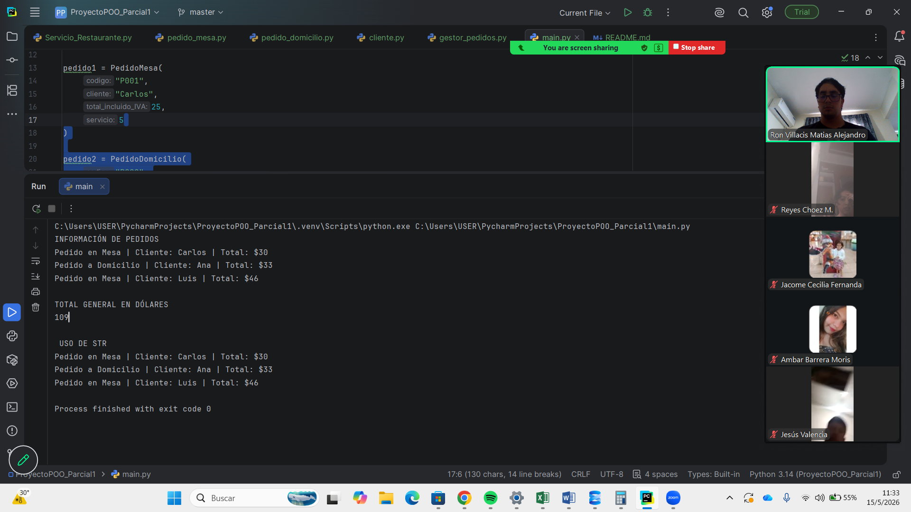

# Proyecto Primer Parcial POO

## Tema
Sistema de Gestión de Servicios de Restaurante

## Integrantes
# Ambar Barrera
# Jesus Valencia
# Mayerly Reyes
# Matías Ron
# Cecilia Jacome

## Descripción
Este proyecto permite gestionar pedidos de restaurante usando Programación Orientada a Objetos.

Se aplican:
- Encapsulamiento
- Herencia
- Polimorfismo
- Métodos especiales

## Clases utilizadas
- ServicioRestaurante es la super clase
- PedidoMesa conjunto a PedidoDomicilio son las clases hijas
- PedidoDomicilio 
- Cliente Es una clase añadida
- GestorPedidos Se usa polimorfismos para poder hacer los cálculos necesarios

## Cómo ejecutar
Ejecutar el archivo: en pestaña main.py

Imágen de la ejecución en zoom
